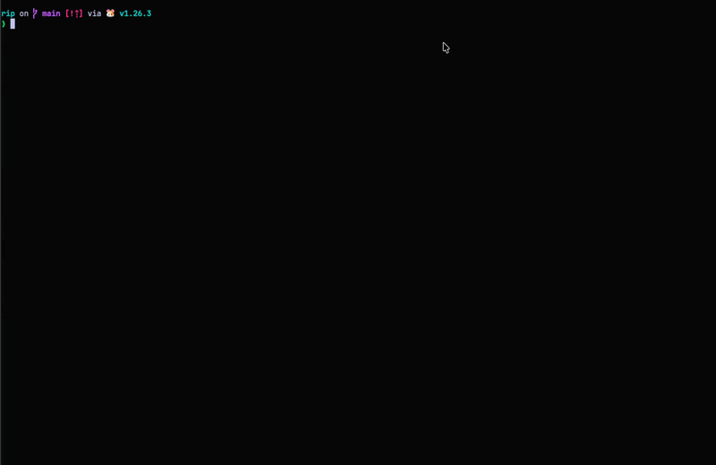

# rip

   

Cross-platform CLI for flashing images to drives.



---

## Install

**macOS / Linux**

```bash
curl -sL https://raw.githubusercontent.com/tq303/rip/main/scripts/install.sh | sh
```

**Windows** (run as administrator)

```bat
curl -sL https://raw.githubusercontent.com/tq303/rip/main/scripts/install.bat -o install.bat && install.bat
```

**Go**

```bash
go install github.com/tq303/rip@latest
```

**Local development**

```bash
make install
```

---

## Usage

```bash
rip [image] [flags]
```

Prompts you to select a drive, confirms before writing, then flashes the image. Accepts a local file or URL.

```bash
rip image.iso
rip image.img --buffer 8
rip https://example.com/image.iso
rip https://example.com/image.iso --output ~/Downloads
```

> Raw copy only — works for standard `.iso` and `.img` disk images. Does not handle images that require bootloader installation (e.g. Windows ISOs).

### Flags

| Flag             | Default | Description             |
| ---------------- | ------- | ----------------------- |
| `-b`, `--buffer` | `4`        | Write buffer size in MB |
| `-f`, `--force`  |            | Skip confirmation prompt |
| `-o`, `--output` | system temp | Download folder for URLs |
